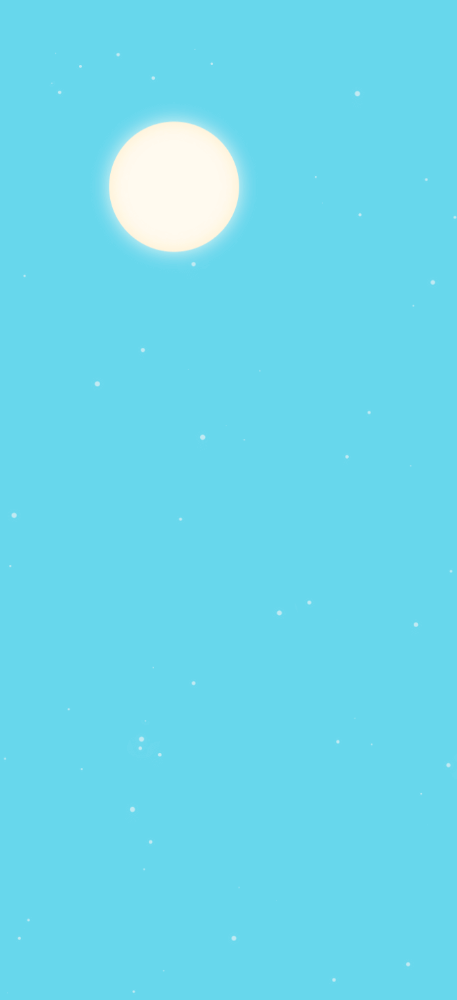

# Day Night

This is a simple day/night cycle animation with a sun and stars.

> Note: It would be fun to add a moon and clouds. Also it could be a starting pint for creating a weather application so that the day/night cycle is based on the location and time of day (by using the Geo location API)

## Demo

- [https://emanuelefavero.github.io/day-night/](https://emanuelefavero.github.io/day-night/)

#### Screenshot

## Usage

- clone the repo and open the `index.html` file in your browser

## License

- [MIT](LICENSE.md)
